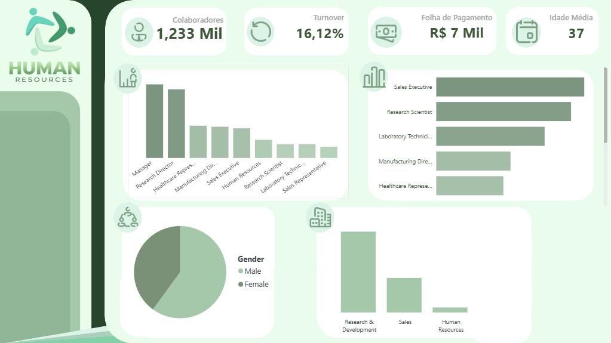

# People Analytics — Employee Insights Dashboard
## Sobre o projeto
Este projeto consiste no desenvolvimento de uma solução de análise de dados voltada para Recursos Humanos, utilizando informações de colaboradores para transformar dados brutos em insights sobre a força de trabalho, remuneração, distribuição dos funcionários e indicadores relacionados à retenção.

O projeto foi desenvolvido com uma abordagem combinando **Python para exploração e análise dos dados** e **Power BI para construção de um dashboard interativo**, permitindo transformar os resultados obtidos durante a análise em uma visualização mais clara e acessível.

## Objetivo
O objetivo do projeto é analisar diferentes características dos colaboradores e responder questões relevantes para uma área de Recursos Humanos, utilizando indicadores e visualizações que auxiliem na compreensão do perfil da organização.

A análise foi estruturada a partir de nove indicadores principais:

1. Total de funcionários ativos
2. Porcentagem de turnover
3. Idade média de funcionários ativos
4. Média salarial
5. Total de funcionários por departamento
6. Percentual de gênero
7. Tempo médio de empresa por departamento
8. Total de funcionários por cargo
9. Faixa salarial por cargo

## Tecnologias utilizadas

- **Python**
- **Pandas**
- **Jupyter Notebook**
- **Power BI**
- **DAX**
- **Git/GitHub**

O Python foi utilizado principalmente para exploração, tratamento, organização e análise dos dados.

O Power BI foi utilizado para transformar os resultados em um dashboard interativo, utilizando medidas e diferentes tipos de visualizações.

## Etapas do projeto

### 1. Exploração dos dados

Inicialmente, foi realizada a exploração do dataset para compreender sua estrutura, suas variáveis e os diferentes tipos de informações disponíveis.

A partir dessa exploração, foram selecionadas as informações relevantes para responder às questões definidas para o projeto.

### 2. Análise dos dados

Foram realizadas análises específicas para cada um dos indicadores definidos, acompanhadas de seus respectivos resultados e insights.

A estrutura do notebook foi organizada de acordo com essas análises, permitindo acompanhar o raciocínio utilizado durante o desenvolvimento do projeto.

### 3. Preparação da base para o Power BI

Após a definição das informações necessárias para o dashboard, foi criada uma base específica contendo somente as colunas utilizadas nas visualizações.

Essa etapa teve como objetivo manter a base do Power BI mais organizada e evitar a utilização de informações que não seriam necessárias para o dashboard.

### 4. Construção do dashboard

Os dados tratados foram posteriormente utilizados no Power BI.

Foram criadas medidas para os principais indicadores e visualizações para representar as informações analisadas no notebook.

O dashboard foi desenvolvido buscando equilibrar **clareza das informações, organização visual e identidade própria**, utilizando uma paleta de cores em tons de verde associada à temática de Recursos Humanos.

## Principais resultados

A análise permitiu identificar alguns dos principais aspectos da força de trabalho:

- **1.233 funcionários ativos** foram identificados na base analisada.
- O **turnover corresponde a 16,12%**.
- A **idade média dos funcionários ativos é de 37 anos**.
- A **média salarial é de aproximadamente R$ 6.832,74**.
- O departamento de **Research & Development** concentra a maior quantidade de funcionários.
- A distribuição por gênero apresenta predominância masculina, com **59,37%**, enquanto **40,63%** dos funcionários são do gênero feminino.
- A análise também permite comparar o tempo médio de empresa entre os departamentos.
- Os cargos podem ser comparados tanto pela quantidade de funcionários quanto pela respectiva faixa salarial.

Esses resultados são apresentados de forma visual no dashboard desenvolvido em Power BI.

## Dashboard

O dashboard reúne os principais indicadores e análises do projeto em uma única interface, permitindo uma visualização rápida do cenário de Recursos Humanos.

> Dashboard desenvolvido no Power BI.
> Uma versão interativa poderá ser disponibilizada posteriormente.

## Desenvolvido por

**A. Nardes**